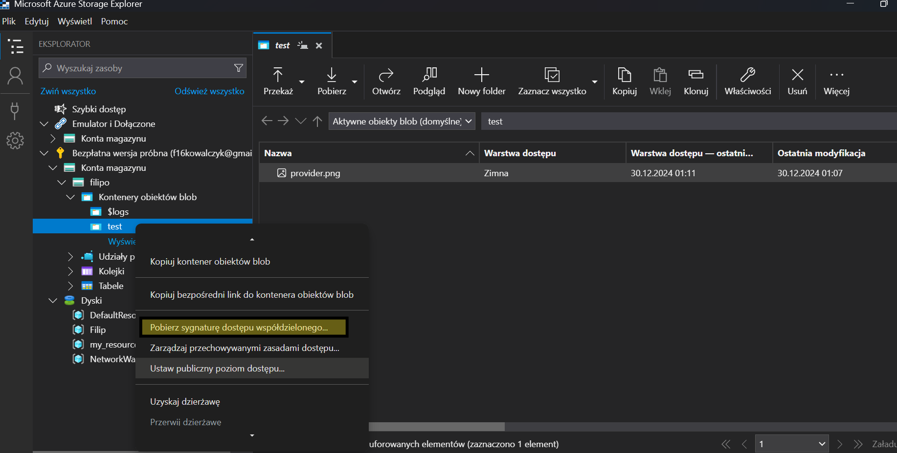

#how to create blob

how to create folder in your storage .

For create and manage folder in your storage you most ctreate container (konta magazynu):

for create click create:

for connect with your storage go to microsoft azure storage explorer

https://azure.microsoft.com/en-us/products/storage/storage-explorer/?msockid=137e9f2f130b657207f78bd412196466#Download-4

and download app

next you can connect to your storage and to your blob folder

for mange your file and add the file you can use drug and drop file

change your managment access for colud that will be a litell bit cheap

and you can also give some one acces to that folder

In that place you can give user access to this folder and file

